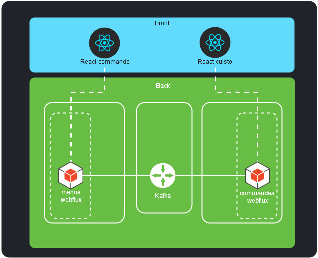

# deliverat
    

Monorepo for the KataKafka

Learn Kafka connecting the microservices of an imaginary delivery service "Deliverat".

## Presentation

[KataKafka Web Presentation](https://blog.dema.in/prez/?fg)

## Design

## Services Cartography

| Port | Service                          |
| ---- | -------------------------------- |
| 3000 | React Commande dev server        |
| 4000 | Json-server                      |
| 5000 | React Cuisto dev server          |
| 6000 | Websocker js dev server          |
| 7000 | Webflux websocket netty Commande |
| 8000 | Webflux rest netty Cartes         |

## French Touch

Une commande is an order in French.

Cuisto is a slang word to say cuisinier which means a chef.

Une carte is a menu in French.

## Music
This repo was created listening to Asteroid - Time :guitar:

The cartes project was created listening to Andromeda Space Ritual - Jupiter is Electric

The presentation was created listening to Heilung - Alfadhirhaiti

## Notes
### RouterFunction and Unit Tests
In this part, we will do some clarifications on things often unknown about WebFluxTest in the functional style of declaring RouterFunction in Spring 5. It is a land still undiscovered !

The @WebFluxTest annotation does not support the testing of functional style RouterFunction, but only WebFlux annotated controllers (that use @Get/@Post endpoints). See this github issue : https://github.com/spring-projects/spring-boot/issues/10683

As seen is this issue, the implementation of @WebFluxTest can't detect RouterFunction beans (like it can do with @Controller classes) because in the new functional style implementation introduced in Spring 5 the RouterFunction is one or more simple beans that can be defined in @Configuration classes without means of recognition.

The kizux user pointed out that WebTestClient.bindToApplicationContext can be use as a workaround.

An other example from Mario Gray can be seen here : https://www.sudoinit5.com/post/spring-boot-testing-producer/

I add that using @SpringBootTest(classes = MenusApplication.class) you will be able to use @Autowired in your test classes to access your functional route config and bind it to a WebTestClient with WebTestClient.bindToRouterFunction.

For example see this commit : [5e0e15c918ad12fd90304684e09507238b631225](https://github.com/neokeld/deliverat/commit/5e0e15c918ad12fd90304684e09507238b631225)

### Unit test an infinite flux
If you want to check that an infinite flux return at least 2 elements, you can zip it with a range and block until you receive these.

See this commit where i replace a dirty (and nondeterministic) thread.sleep hack with a zip : [5e5ff5c4d8bcfb8e50c7e96b07dbee66bdb48462](https://github.com/neokeld/deliverat/commit/5e5ff5c4d8bcfb8e50c7e96b07dbee66bdb48462)

### Automating Integration Testing with Maven, Spring and Travis CI
The recipe is simple :
* Configure spring-boot-maven-plugin in pom.xml to start service before running integration tests and stop it after.
* Add IT at the end of the name of integration tests classes to execute them with Failsafe instead of Surefire.
* Configure your service port as you wish (for example in application.properties in test directory).
* Use mvn verify to run your ITs.

See this commit : [4a05a0c4f3cdb30ea9212f8be904eab80ef7ab7c](https://github.com/neokeld/deliverat/commit/4a05a0c4f3cdb30ea9212f8be904eab80ef7ab7c)

## Thanks
Spring Initializr for their useful tool to create Spring projects.

The underrated [java-faker](https://github.com/DiUS/java-faker) that produce fun and useful data for demos.

The brilliant [json-server](https://github.com/typicode/json-server) which is the fake json rest backend of your dreams.

The convenient for two years [react-lines-ellipsis](https://github.com/xiaody/react-lines-ellipsis).

The spectacular [spectacle](https://github.com/FormidableLabs/spectacle).

## License

Copyright (c) 2018 Arnaud Duforat

See LICENSE file to know more (MIT License).

